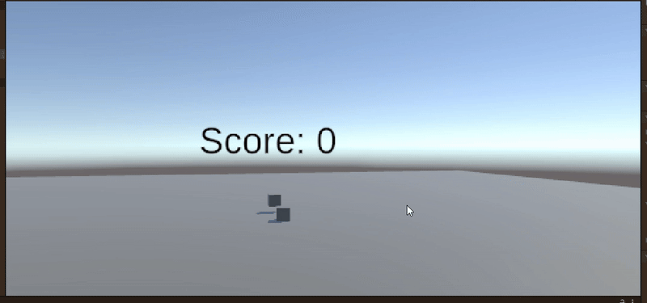
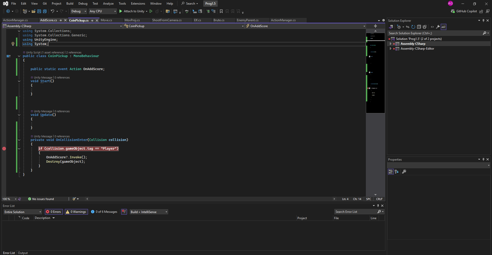
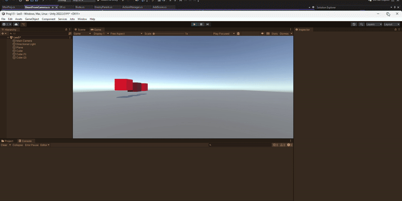

#  Prog-1.5 Lessons & Space48 Project

This repository contains Unity projects and scripts from the **Prog-1.5** course, along with the **Space48** project.  
Each lesson demonstrates key programming concepts such as **DRY (Don’t Repeat Yourself)** and **SRP (Single Responsibility Principle)** in Unity.

---

##  **Lesson 1**
**Assignments:** 1, 2, 3  
**Scripts:** [Les1 Scripts](https://github.com/zmbfiedk/Prog-1.5/tree/main/Assets/Scripts/Les1)  
**Demo:**   

 *In this lesson, we revisited the basics to refresh our understanding of fundamental Unity scripting concepts.*

---

## **Lesson 2**
**Scripts:** [Les2 Scripts](https://github.com/zmbfiedk/Prog-1.5/tree/main/Assets/Les2)  
**Demo:**   

*We explored how **Action Events** work and how to connect them with other scripts and functions to improve communication between game objects.*

---

## **Lesson 3**
**Demo:**   
**Tower Defense Issues:** [Tower Defense Repo Issues](https://github.com/zmbfiedk/Tower-Defense/issues)  

*This lesson focused on identifying dependencies and debugging issues in our Tower Defense project.*

---

## **Lesson 4 — Space48 Project**
**Scripts:** Located in a separate repository  
**Repository:** [Space48](https://github.com/zmbfiedk/Space48)  
**Demo:**   

*In this lesson, we worked on the **Space48** project, which demonstrates the principles of **DRY** and **SRP** through clean, modular code and reusable systems.*

---

##  **Lesson 5**
**Scripts:** [Les5 Scripts](https://github.com/zmbfiedk/Prog-1.5/tree/main/Assets/Les5)  
**Demo:**   

*We practiced **inheritance-based programming**, creating multiple enemy types that share functionality through a common base class.*

---

## **Lesson 6**
**Project:** [Tower Defense Repository](https://github.com/zmbfiedk/Tower-Defense)  

 *In the final lesson, we mapped out and documented all **dependencies** in our Tower Defense project to better understand the overall architecture.*

---

### Summary
This repository highlights progress made throughout the **Prog-1.5** course — from basic scripting concepts to object-oriented programming principles and project dependency management.  
Each lesson builds upon the previous one, showing a steady improvement in coding structure, reusability, and project organization.
