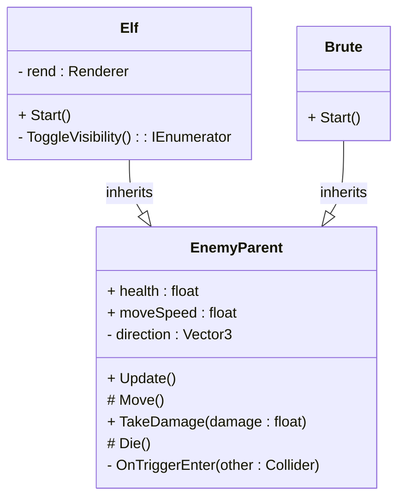
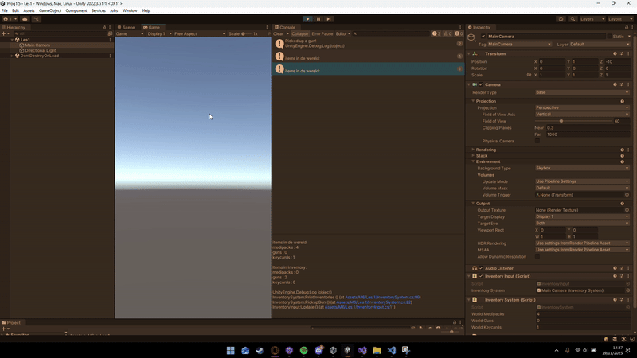

#  Prog-1.5 Lessons & Space48 Project

This repository contains Unity projects and scripts from the **Prog-1.5** course, along with the **Space48** project.  
Each lesson demonstrates key programming concepts such as **DRY (Don’t Repeat Yourself)** and **SRP (Single Responsibility Principle)** in Unity.

---

##  **Lesson 1**
**Assignments:** 1, 2, 3  
**Scripts:** [Les1 Scripts](https://github.com/zmbfiedk/Prog-1.5/tree/main/Assets/Scripts/Les1)  
**Demo:**   

 *In this lesson, we revisited the basics to refresh our understanding of fundamental Unity scripting concepts.*

---

## **Lesson 2**
**Scripts:** [Les2 Scripts](https://github.com/zmbfiedk/Prog-1.5/tree/main/Assets/Les2)  
**Demo:**   

*We explored how **Action Events** work and how to connect them with other scripts and functions to improve communication between game objects.*

---

## **Lesson 3**
**Demo:**   
**Tower Defense Issues:** [Tower Defense Repo Issues](https://github.com/zmbfiedk/Tower-Defense/issues)  

*This lesson focused on identifying dependencies and debugging issues in our Tower Defense project.*

---

## **Lesson 4 — Space48 Project**
**Scripts:** Located in a separate repository  
**Repository:** [Space48](https://github.com/zmbfiedk/Space48)  
**Demo:**   

*In this lesson, we worked on the **Space48** project, which demonstrates the principles of **DRY** and **SRP** through clean, modular code and reusable systems.*

---

##  **Lesson 5**
**Scripts:** [Les5 Scripts](https://github.com/zmbfiedk/Prog-1.5/tree/main/Assets/Les5)  
**Demo:**   

*We practiced **inheritance-based programming**, creating multiple enemy types that share functionality through a common base class.*

---

## **Lesson 6**
**Project:** [Tower Defense Repository](https://github.com/zmbfiedk/Tower-Defense)  

 *In the final lesson, we mapped out and documented all **dependencies** in our Tower Defense project to better understand the overall architecture.*

---

## **Lesson 7**

---
title: Class Diagram - Tower Defense Enemies
---

[TowerDefense ClassDiagram Op Readme](https://github.com/zmbfiedk/Tower-Defense/tree/main)

## **Lesson 8**

-This lesson emphasized writing scripts without magic numbers, utilizing Enums to improve readability and maintainability.

-[Script](https://github.com/zmbfiedk/Tower-Defense/blob/Dev/Assets/Scripts/Towers/Tower%20Behaiviour/TowerAttackController.cs)

---
### Summary
This repository highlights progress made throughout the **Prog-1.5** course — from basic scripting concepts to object-oriented programming principles and project dependency management.  
Each lesson builds upon the previous one, showing a steady improvement in coding structure, reusability, and project organization.

## **M6 Lesson 1**
# Inventory System – Code Conventions Assignment

## Assignment Description
For this lesson, I created an **Inventory System** following Unity’s code conventions.  
The system uses a **base class, inheritance, a List, clean structure, correct naming rules, serializefields**, and clear English comments.

The Inventory System works fully in the **Console**, where the player can pick up or drop items using keyboard inputs.

---

## Features

### InventoryItem (base class)
Shared data for all item types.

### Three item types (inheritance)
- WeaponItem  
- MedipackItem  
- KeycardItem  

### InventorySystem
Handles:
- Adding items  
- Removing items  
- Console output  
- A `List<InventoryItem>`  

### Input controls
- **G** → Pick up gun  
- **M** → Pick up medipack  
- **K** → Pick up keycard  
- **1** → Drop gun  
- **2** → Drop medipack  
- **3** → Drop keycard  

---

## Code Structure
The system follows Unity conventions:
- PascalCase for classes and public methods  
- camelCase with `_underscore` for private fields  
- Script layout: fields → properties → MonoBehaviours → public methods → private methods  
- English comments and summaries  
- `[SerializeField]` for Inspector values  

---

## Scripts
Link to all related scripts:

 **[M6-Les-1-Scripts](https://github.com/zmbfiedk/Prog_Leerjaar-2/tree/main/Assets/M6/Les%201)**

---

## Demo GIF

